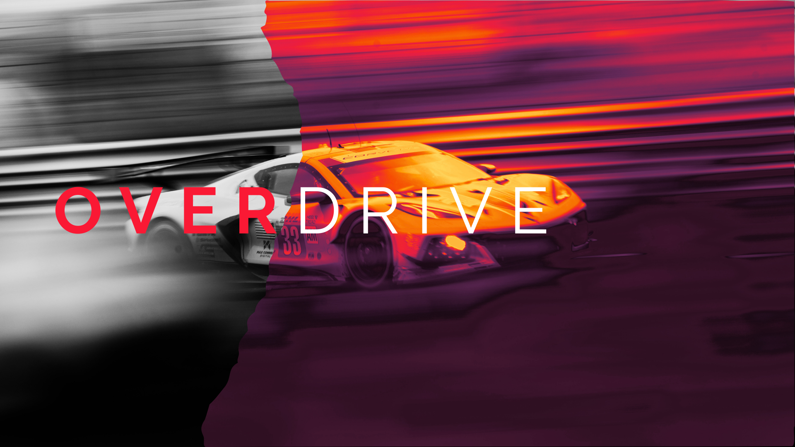

<!-- HEADER -->
<h1 align="left">OVERDRIVE</h1>
</img>
<h3>"The next-generation racing simulation, driven by the community"</h3>
<p align="center">
  <a href="https://github.com/dnbsammie/overdrive/issues">
    
  </a>
  <a href="https://github.com/dnbsammie/overdrive/stargazers">
    
  </a>
  <a href="https://github.com/dnbsammie/overdrive/blob/main/readme/LICENSE">
    
  </a>
</p>

<!-- TABLE OF CONTENTS -->
<details>
  <summary>Table of Contents</summary>
  <ol>
    <li><a href="#about-the-project">About The Project</a></li>
    <li><a href="#features">Features</a></li>
    <li><a href="#getting-started">Getting Started</a></li>
    <li><a href="#contributing">Contributing</a></li>
    <li><a href="#gallery">Gallery</a></li>
    <li><a href="#license">License</a></li>
  </ol>
</details>
<!-- ABOUT THE PROJECT -->
<h2 id="about-the-project">🎯 About The Project</h2>
<p>
  Overdrive is an open-source racing simulator, created with the aim of providing a realistic and customizable driving experience.
</p>

<!-- <p>Link: <a href="#"> click here.</a></p> -->

<h3 align="left">Languages and Tools 🛠</h3>

<p align="left">
  <a href="https://skillicons.dev">
    
  </a>
</p>

<!-- FEATURES -->
<h2 id="features">✨Main Features</h2>
<h3>Objectives:</h3>
<ol>
    <li><strong>Advanced Conduction Physics: </strong>A tire and aerodynamics simulation model developed from scratch, ensuring a true-to-life experience.</li>
    <li><strong>Modular Content: </strong>A system of cars and tracks that allows the community to easily add, modify, and share content.</li>
    <li><strong>Full Hardware Support:</strong>Native compatibility with steering wheels, pedals, gear shifters, and more.</li>
</ol>
<!-- GETTING STARTED -->
<h2 id="getting-started">🚀 Getting Started</h2>

<p>Instructions for setting up the project locally</p>
<h4>For Players (Precompiled):</h4>

<ol>
  <li>Download the latest executable version from <code>releases</code> branch.</li>
  <li>Unzip the file and run the game directly.</li>
  <li>The executable will be in the folder <code>build/bin</code>.</li>
</ol>

<h4>For Developers (From the Source Code)</h4>

```shell
# Clone the repository
git clone https://github.com/dnbsammie/overdrive.git
cd overdrive
```

<h3>⚙️ Technologies and System Requirements</h3>

<h3>Technologies Used</h3>
<ul>
  <li><strong>Game Engine:</strong> Unity engine</li>
  <li><strong>Programming Language:</strong> C#, JSON</li>
  <!-- <li><strong>Physics:</strong> ?</li>
  <li><strong>Rendering:</strong> ?</li>
  <li><strong>Audio:</strong> ?</li>
  <li><strong>Networking:</strong> ?</li> -->
</ul>

<!-- <h3>System Requirements</h3>
<table>
  <thead>
    <tr>
      <th>Component</th>
      <th>Minimum</th>
      <th>Recommended</th>
    </tr>
  </thead>
  <tbody>
    <tr>
      <td>Operating System</td>
      <td>?</td>
      <td>?</td>
    </tr>
    <tr>
      <td>CPU</td>
      <td>?</td>
      <td>?</td>
    </tr>
    <tr>
      <td>GPU</td>
      <td>?</td>
      <td>?</td>
    </tr>
    <tr>
      <td>RAM</td>
      <td>?</td>
      <td>?</td>
    </tr>
    <tr>
      <td>Storage</td>
      <td>?</td>
      <td>? (SSD)</td>
    </tr>
  </tbody>
</table> -->
<!-- CONTRIBUTING -->
<h2 id="contributing">🤝 Contributing</h2>
<p>I greatly appreciate your contributions to this project! To maintain order and clarity, please use the predefined templates for Pull Requests and Issues. Follow the steps below:</p>

<h3>How to send a Pull Request (PR)?</h3>
<p>If you would like to propose a change, follow these steps. For new features, always use a branch named <code>features/your-feature-name</code>.</p>
<ol>
  <li>Fork the repository</li>
  <li>Create a new branch following the naming convention</li>
  <li>Before pushing, run <code>git pull origin main</code> to sync with the latest changes</li>
  <li>Open a Pull Request using the <code>pull_request_template.md</code>. Do not skip the template.</li>
  <li>Complete all required fields: description, motivation, and context</li>
</ol>


<h3>How to report an Issue?</h3>
<p>If you find a bug or have a suggestion, please open an Issue.  For bug fixes or issue-related work, use <code>issues/issue-number</code>.</p>
<ol>
  <li>Go to the <strong>Issues</strong> section of the repository.</li>
  <li>Click on **New Issue**.</li>
  <li>GitHub will offer you different types of templates. Select the one that best suits your needs (for example, "<code>bug_report</code>" or "<code>features_request</code>").</li>
  <li>Fill out the template with as much detail as possible so that we can help you efficiently.</li>
</ol>
<p>Your help is invaluable! If you have any questions or need assistance, don’t hesitate to reach out.</p>
<!-- LICENSE -->
<h2>⚖️ License</h2>
<p>This project is open-source and is released under the <a href="https://opensource.org/licenses/MIT" target="_blank">MIT License</a>.</p>
<p>This license grants you the freedom to use, copy, modify, merge, publish, distribute, sublicense, and/or sell copies of the software. We invite you to use our work as a foundation for your own projects, both personal and commercial.</p>
<p>If you have any questions about the license or its application, please feel free to open an issue or contact me directly.</p>

---

<h4>🚀 Enjoy the code and keep improving the project!</h4>